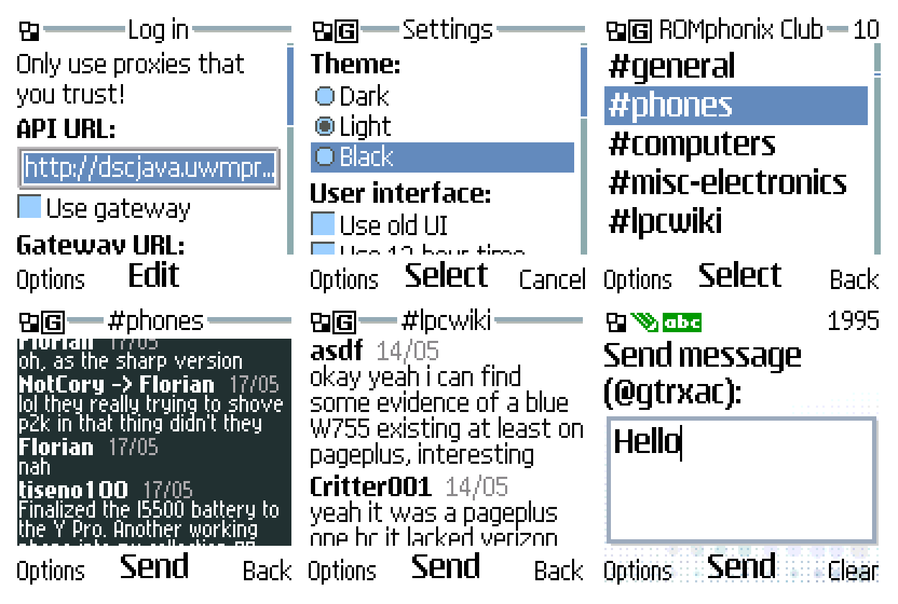

# Discord for J2ME
Discord client for Java ME (MIDP 2.0) devices, inspired by [Discord for Symbian](https://github.com/uwmpr/discord-symbian-fixed). Uses proxy servers for the [HTTP](/proxy/) and [gateway](https://github.com/gtrxAC/discord-j2me-server) connection.

* [Download](https://github.com/gtrxAC/discord-j2me/releases/latest)
* [FAQ](https://github.com/gtrxAC/discord-j2me/wiki/FAQ)
* [Discord server](https://discord.gg/2GKuJjQagp) (#apps-and-games)
* [Telegram group](https://t.me/dscforsymbian)

## Status
### Working
* Server and channel lists
* Message reading, sending, editing, <abbr title="Only your own messages">deleting</abbr>
* Replying to messages
* Reading older messages
* Direct messages and group DMs
* Attachment viewing
* Attachment sending (<abbr title="Requires FileConnection API or HTML browser with file uploading support">device dependent</abbr>)
* Gateway/live message updates (<abbr title="Not supported on some low-end Samsung devices">device dependent</abbr>)
* <abbr title="Not in sync with official clients">Unread message indicators</abbr>

### Not implemented
* Jumping to messages (e.g. replies)
* Initiating DM conversations
* Ping indicators
* Reactions and emojis

## How to build
1. Create an `sdk` folder inside the repo with the following contents:
    * `jdk1.6.0_45` folder containing that version of the Java Development Kit.
        * If you have another JDK installation that supports Java 1.3, you can change the `OLD_JAVA_HOME` variable in `build.sh` to point to it.
    * `jdk-22.0.1` folder containing that version of the JDK.
        * If you have another modern JDK installation, change the `JAVA_HOME` variable in `build.sh`.
        * On Linux, you may be able to use the `OLD_JAVA_HOME` in place of the modern JDK.
    * `cldcapi11.jar`, `midpapi20.jar`, and `jsr75.jar` from the Sun Wireless Toolkit.
    * `proguard.jar` (can be found in the `lib` folder inside the ZIP available [here](https://github.com/Guardsquare/proguard/releases))
2. Run `build.sh`.

## Thanks
* [@uwmpr](https://github.com/uwmpr) for formerly hosting the default proxy server
* [@WunderWungiel](https://github.com/WunderWungiel) for formerly hosting the CDN proxy
* [@shinovon](https://github.com/shinovon) for their Java ME [JSON library](https://github.com/shinovon/NNJSON)
